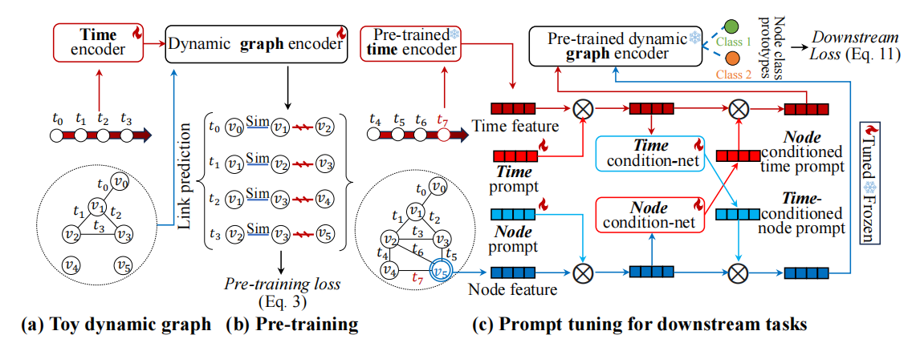

# DyGPrompt: NODE-TIME CONDITIONAL PROMPT LEARNING IN DYNAMIC GRAPHS


## Running the experiments
```{bash}
cd DyGPrompt
pip install -r requirements.txt
```

### Dataset and Preprocessing

#### Download the public data
Download the sample datasets (eg. wikipedia and reddit) from
[here](http://snap.stanford.edu/jodie/) and store their csv files in a folder named
```data/```.

#### Preprocess the data
We use the dense `npy` format to save the features in binary format. If edge features or nodes 
features are absent, they will be replaced by a vector of zeros. 
```{bash}
python utils/preprocess_data.py --data wikipedia
python utils/preprocess_data.py --data reddit
```
### Model Training

Self-supervised learning using the link prediction task:
```{bash}
# TGN-attn: Supervised learning on the wikipedia dataset
python train_self_supervised.py --use_memory --prefix tgn-attn --n_runs 10

# TGN-attn-reddit: Supervised learning on the reddit dataset
python train_self_supervised.py -d reddit --use_memory --prefix tgn-attn-reddit --n_runs 10
```
